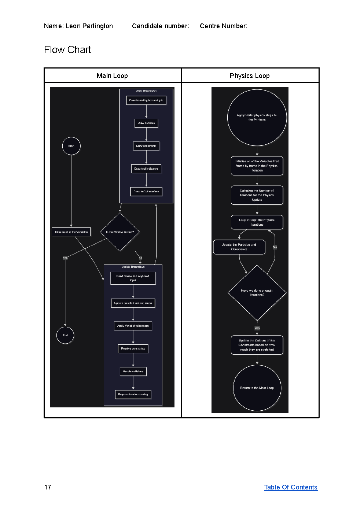
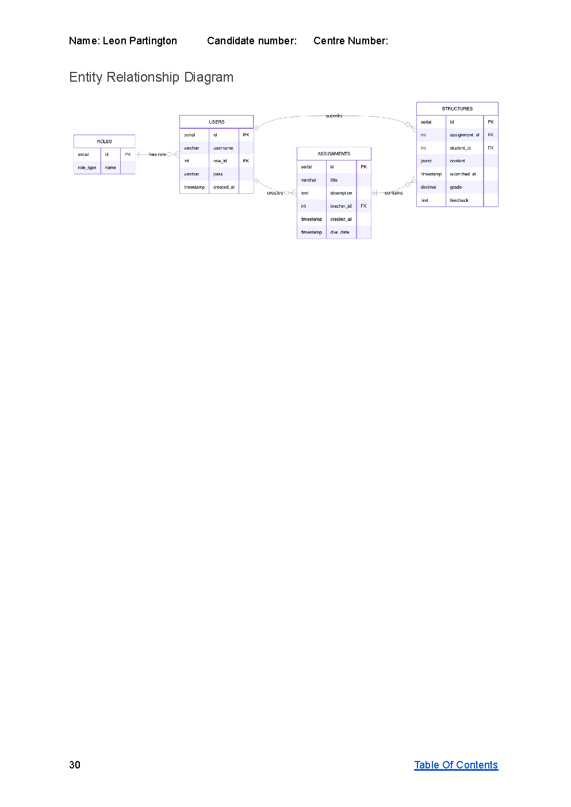
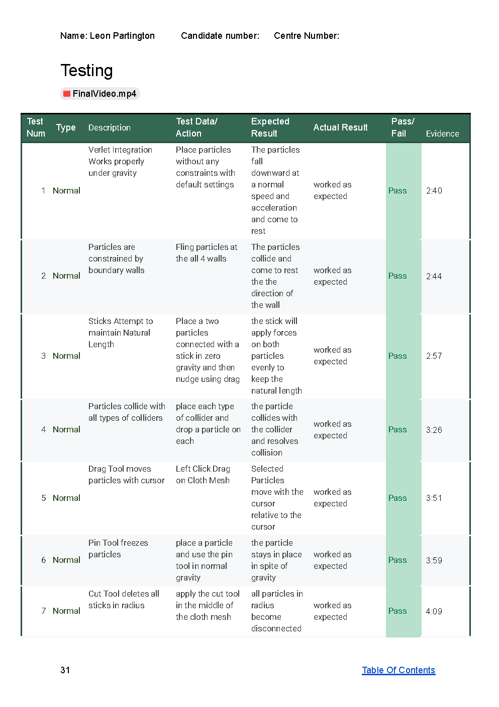
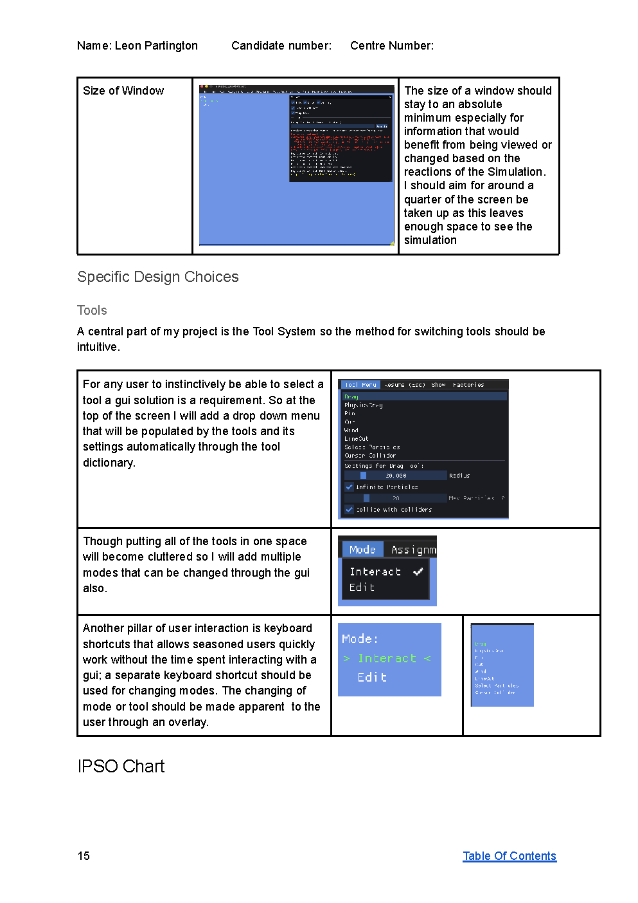

# A-Level NEA: Verlet-Integration Cloth Physics

A cloth physics simulation built in **C# with MonoGame** for my A-Level Computer Science NEA on the AQA exam Board. The technical solution scored **42 out of 42 marks**.

## Project objectives

- Develop a real-time 2D cloth simulation using Verlet integration that is stable, responsive, and suitable for experimentation.
- Create an interactive workspace where users can build, edit, and inspect mesh-based physics structures.
- Implement believable physical behaviour using constraints, external forces, and collision handling in a controllable environment.
- Support iterative testing by allowing users to pause, step, and adjust simulation behaviour while observing visual feedback.
- Provide a way to save, load, and manage simulation structures so progress can be continued and compared over time.
- Design a clear, usable interface that brings together simulation controls, editing tools, and diagnostics in one application.
- Maintain a modular codebase with documentation and a reproducible setup process to support development and evaluation.

## Why Verlet integration?

Velocity is derived from the *previous* and *current* positions of each particle, which makes it far more suitable than classic Euler integration for a constrained-particle simulation: collisions and restraints are handled simply by changing the current position.

Later iterations also store accumulated force on each particle (spring constants), producing a hybrid of Euler and Verlet integration.

## Tech stack

- **C# · MonoGame**
- Verlet integration and particle spring physics
- Rendered with my own vector-primitives library — published separately as [MonoGame2DVectorGraphics](https://github.com/Ibi-bit/MonoGame2DVectorGraphics)
- GUI/menu system via an open-source ImGui extension for MonoGame
- Doxygen documentation (`Doxyfile`)

## Repository layout (highlights)

- `PhysicsCSAlevlProject/` — the main game/physics project
- `infrastructure/` — build and support tooling
- `LegacyJsonConverter/` — legacy data-conversion tooling
- `*.tsv` / `*.mmd` — AQA specification tables and flow diagrams

## Getting started

The repository uses git submodules, so clone with:

```sh
git clone --recurse-submodules https://github.com/Ibi-bit/ClothPhysicsVerletIntegrationCSNEA.git
cd ClothPhysicsVerletIntegrationCSNEA
```

If you already cloned without submodules:

```sh
git submodule update --init --recursive
```

### Branch

The GitHub UI shows `working-interactive-features` as the active branch:

```sh
git checkout working-interactive-features
git pull
git submodule update --init --recursive
```

### Prerequisites

Git (with submodule support), and the .NET SDK (9.x):

```sh
dotnet --version   # should start with 9. (8 should also work)
```

### Restore + build

The main project folder is `PhysicsCSAlevlProject`:

```sh
dotnet restore PhysicsCSAlevlProject
dotnet build -c Release PhysicsCSAlevlProject
```

### Run

```sh
dotnet run --project PhysicsCSAlevlProject -c Release
```

### Database (Docker)

All Docker and SQL database files are in `infrastructure/database`.

Windows:

```sh
cd infrastructure\database
.\setup.ps1      # set up
.\run.ps1        # start (keeps existing data)
```

Linux/macOS:

```sh
./infrastructure/database/setup.sh   # set up from scratch (recreates container + volume, reapplies schema and sample data)
./infrastructure/database/run.sh     # start normally (keeps existing data)
```

If Docker Desktop is not running, start it first (`open -a Docker`).

### Troubleshooting

- **Submodule folder empty / missing files:** re-run `git submodule update --init --recursive`
- **Switched branches and submodules look "wrong":**
  ```sh
  git submodule sync --recursive
  git submodule update --init --recursive
  ```

## Controls

**General:**
- `Esc` — pause / resume simulation
- `Space` (while paused) — step 1 physics tick
- `Ctrl + Z` — undo
- `Ctrl + Shift + Z` — redo
- `Shift + Tab` — next mode
- `Shift + Alt/Ctrl + Tab` — previous mode (Alt on macOS, Ctrl on Windows/Linux)

**Tools & modes:**
- `Ctrl + T` — next tool
- `Ctrl + Shift + T` — previous tool
- `D` — switch to Drag tool

**Tool-specific:**
- `C` (Create Grid Mesh tool): build grid in selected rectangle

## Project Writeup

The full A-Level NEA report (["Verlet Physics Sandbox"](NEA-Writeup.pdf) — Analysis, Design, Testing and Evaluation) is included as [NEA-Writeup.pdf](NEA-Writeup.pdf); GitHub renders it in the browser.


*Flow chart of the main and physics loops.*


*Entity-relationship diagram for the database design.*


*Excerpt from the testing log.*


*Design rules and IPSO chart from the writeup.*
